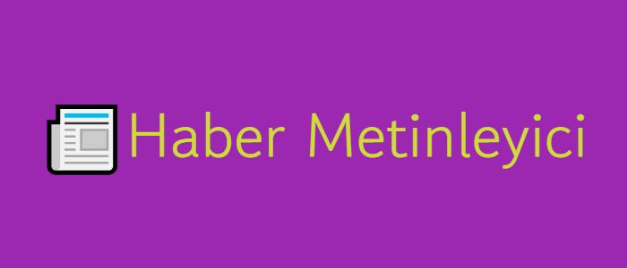

kullanıcıların belirlediği anahtar kelimelere göre haber metinleri üreten bir Windows Forms uygulaması. Kullanıcı dostu arayüz ile girilen anahtar kelimler ile haber metni üretir.
## Kullanım
* "Anahtar kelimeler " kutusuna , haber metninde geçmesini istediğiniz kelimeleri yazın. Haber üret butonuna tıklayın. Üretilen haber metni , sol tarafta metin kutusunda gözükür.
## ⚙️Kurulum
* Projeyi klonlayın
```sh
git clone https://github.com/K4rdinal/News-Writer.git
```
* Projeyi derleyin

'Build' menüsünden 'Build Solution' seçeneğine tıklayın. " Ctrl+Shift+B " kısayolunu da kullanabilirsiniz.

* Uygulamayı çalıştırın

'Debug' menüsünden 'Start Debugging' seçeneğine tıklayın. " F5 " kısayolunu da kullanabilrsiniz.
## 👾Katkıda Bulunma
katkıda bulunmak isterseniz , lütfen bir pull request açın ✨
  